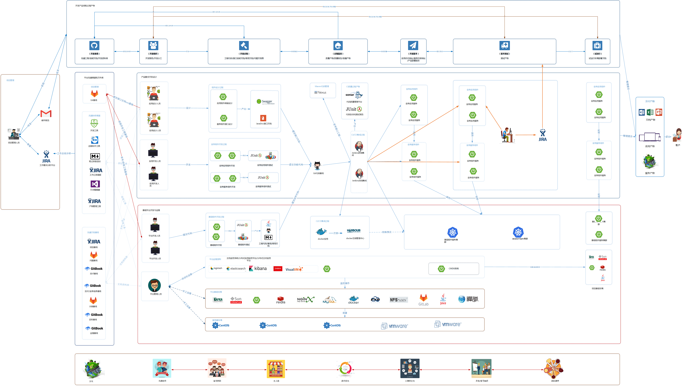

### [中文版](README.cn.md) | [English](README.md)
#### 项目推荐

* 基于fastboot的im聊天系统 -> fastboot-im  
  https://gitee.com/stylesmile/fastboot-im.git  
  https://github.com/stylesmile/fastboot-im.git

# 项目介绍

极速的java web 框架，比起常用框架，启动速度提高20倍，五分之一内存占用，启动不到0.1秒，20-30m最小内存占用

# 项目愿景

java领域最佳云原生解决方案。

# 个人愿景

* 需要的是一个平台，在这个平台上面，不断沉淀自己，毕竟每天都在学习东西，接触新的技术点

* 有方向感，不迷茫，不浪费时间，有可行的学习计划
* 在工作和学习过得中不断积累和提高学习效率
* 可以总结和反思，过程可以不断的打磨出一个平台，一个产品或者一个精品
* 希望自己写这个项目的过程技术越来越好

## 支持说明

为了可以更好的开源和支撑，以下为提供的技术支持，协助企业快速云原生化平台化和中台化

* 企业DevOps技术平台搭建和落地指导
* 企业自动化和持续集成体系支持
* 企业云原生化中台化和平台化架构规划和设计指导
* 企业过程技术答疑和技术指导
* 如需技术支持，或者加群交流：


### 云原生概念

#### [云原生是什么](doc/云原生/云原生是什么.md)

#### [如何云原生](doc/云原生/如何云原生.md)

### devOps架构

基础 DevOps 技术体


### 整体架构支撑

整体架构支撑是为了整体平台的流程，从管理、开发、测试、运维、生产几条线，
实现整体平台的落地和管理


#### [快速开始详细文档](doc/1.fastboot-start.md)

#### [快速开始 k8s部署fastboot](doc/云原生/Kubernetes/k8s部署简单fastboot.md)

#### [快速开始 docker部署fastboot](doc/应用开发手册/docker/docker部署简单应用.md)

#### [快速开始 graalvm本地镜像](doc/应用开发手册/graalvm/graalvm部署打包本地镜像.md)

#### [快速开始 mybatis](doc/db/1.fastboot-mybatis.md)

#### [快速开始 redis](doc/db/2.fastboot-redis.md)

#### [快速开始 mongodb](doc/db/3.fastboot-mongodb.md)

#### [快速开始 beetlsql](doc/db/4.fastboot-beetlsql.md)

#### [快速开始 模板引擎 enjoy](fastboot-example%2Ffastboot-enjoy-example%2Fpom.xml)

#### [快速开始 login 权限拦截案例](fastboot-example%2Ffastboot-web-parent-example%2Ffastboot-web-login-example)

#### [快速开始 自定义注解实现aop](doc%2Ftool%2F%E8%87%AA%E5%AE%9A%E4%B9%89%E6%B3%A8%E8%A7%A3%E5%AE%9E%E7%8E%B0aop.md)

应用开发手册：[访问](doc/应用开发手册/应用开发手册.md)

##### 快速开始 [example](fastboot-example/fastboot-web-example)

### 开发规范

#### [1.java编码的基本规范](doc/应用开发手册/开发规范/1.java编码的基本规范.md)

#### [2.mysql规范.md](doc/应用开发手册/开发规范/2.mysql规范.md)

#### [3.redis规范.md](doc/应用开发手册/开发规范/3.redis规范.md)

```maven
<parent>
    <groupId>io.github.stylesmile</groupId>
    <artifactId>fastboot-parent</artifactId>
    <version>2.9.5</version>
</parent>
```

```maven
<dependency>
    <groupId>io.github.stylesmile</groupId>
    <artifactId>fastboot-web</artifactId>
</dependency>
```

##### 如果你管理依赖用的gradle[参考gradle配置](doc/1.fastboot-start-gradle.md)

```java

import io.github.stylesmile.annotation.Controller;
import io.github.stylesmile.annotation.RequestMapping;
import io.github.stylesmile.app.App;

@Controller
public class Application {
    public static void main(String[] args) {
        App.start(Application.class, args);
    }

    @RequestMapping("/")
    public String hello() {
        return "hello fastboot";
    }
}
```

#### 发布最新版后，其他各个镜像仓库可能过好几天才同步镜像，可以用maven官方仓库原仓库下载

```maven
<repository>
    <id>maven1</id>
    <url>https://repo1.maven.org/maven2/</url>
</repository>        
<repository>
    <id>maven1</id>
    <url>https://s01.oss.sonatype.org/content/repositories/releases/</url>
</repository>
```

占用20m内存，启动时间仅需01秒（服务器是1核1g的虚拟机）


#### 开发遇到问题

[问题解决](doc%2F%CE%CA%CC%E2%BD%E2%BE%F6.md)
