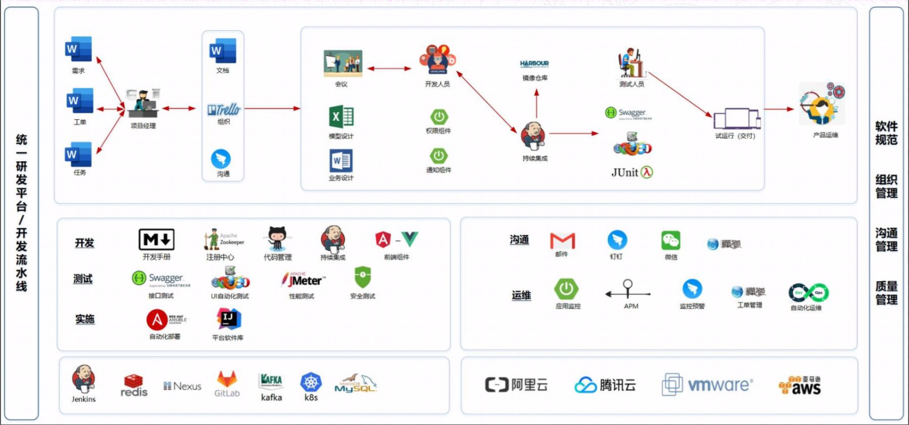
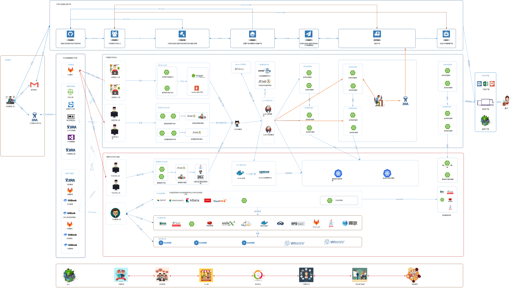
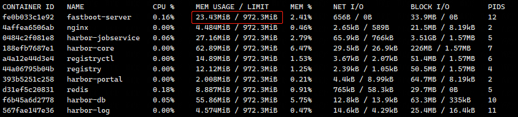
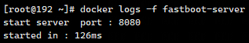

### [中文版](README.cn.md) | [English](README.md)

# Introduction

a Extremely fast Java web framework, with a startup speed 20 times faster than commonly used frameworks, one-fifth memory usage, less than 0.1 seconds startup, and a minimum memory usage of 20-30m

# Project Vision

The best cloud native solution in the Java field.

# Personal Vision

* What is needed is a platform, on which one can constantly cultivate oneself, after all, learning things and being exposed to new technological points every day
* Has a sense of direction, is not confused, does not waste time, and has a feasible learning plan
* Continuously accumulate and improve learning efficiency through work and study experience
* It can be summarized and reflected on, and the process can be continuously polished to create a platform, a product, or a masterpiece
* I hope to improve my process skills in writing this project

## Support Description

In order to better open source and support, the following technical support is provided to assist enterprises in quickly realizing cloud based bio platform and platform integration

* Construction and Implementation Guidelines for Enterprise DevOps Technology Platform
* Enterprise automation and continuous integration system support
* Planning and design guidance for the architecture of enterprise cloud original biochemistry in Taiwan and Taiwan
* Enterprise Process Technology Q&A and Technical Guidance
* If you need technical support or group communication, please follow the official account and WeChat communication:


### Cloud native concept

#### [What is cloud native](doc/云原生/云原生是什么.md)

#### [How to cloud native](doc/云原生/如何云原生.md)

### Basic DevOps Technology Body




### Overall architecture support

The overall architecture support is for the overall platform process, covering management, development, testing, operation and maintenance, and production lines,

Implement the landing and management of the overall platform


#### [Quickly start detailed documentation](doc/1.fastboot-start.md)

#### [Quickly start k8s deployment for fastbost (base rainbond)](doc/云原生/Kubernetes/k8s部署简单fastboot.md)

#### [Quickly start Docker deployment fastboot](doc/应用开发手册/docker/docker部署简单应用.md)

#### [Quickly start local mirroring of graalvm](doc/应用开发手册/graalvm/graalvm部署打包本地镜像.md)

#### [Quickly start about mybatis](doc/db/1.fastboot-mybatis.md)

#### [Quickly start about redis](doc/db/2.fastboot-redis.md)

#### [Quickly start about mongodb](doc/db/3.fastboot-mongodb.md)

#### [Quickly start about beetlsql](doc/db/4.fastboot-beetlsql.md)
#### [Quickly start about template engine enjoy](fastboot-example%2Ffastboot-enjoy-example%2Fpom.xml)

Application Development Manual：[visit](doc/应用开发手册/应用开发手册.md)

##### Quickly start [example](fastboot-example/fastboot-web-example)

### Development specifications

#### [1.Basic specifications for Java coding](doc/应用开发手册/开发规范/1.java编码的基本规范.md)

#### [2.specifications](doc/应用开发手册/开发规范/2.mysql规范.md)

#### [3.redisspecifications](doc/应用开发手册/开发规范/3.redis规范.md)

```maven
<parent>
    <groupId>io.github.stylesmile</groupId>
    <artifactId>fastboot-parent</artifactId>
    <version>2.7.8</version>
</parent>
```

```maven
<dependency>
    <groupId>io.github.stylesmile</groupId>
    <artifactId>fastboot-web</artifactId>
</dependency>
```

##### If you manage the gradle used for dependency
[Refer to Gradle configuration](doc/1.fastboot-start-gradle.md)

```java

import io.github.stylesmile.annotation.Controller;
import io.github.stylesmile.annotation.RequestMapping;
import io.github.stylesmile.app.App;

@Controller
public class Application {
    public static void main(String[] args) {
        App.start(Application.class, args);
    }

    @RequestMapping("/")
    public String hello() {
        return "hello fastboot";
    }
}
```

#### After the latest version is released, it may take several days for other image repositories to synchronize the images, which can be downloaded from the original Maven official repository

```maven
<repository>
    <id>maven1</id>
    <url>https://repo1.maven.org/maven2/</url>
</repository>        
```


20 m of memory occupied, with a startup time of only 01 seconds (the server is a 1-core 1g virtual machine)



#### Development encountered issues
[Problem Solving List](doc%2F%CE%CA%CC%E2%BD%E2%BE%F6.md)
