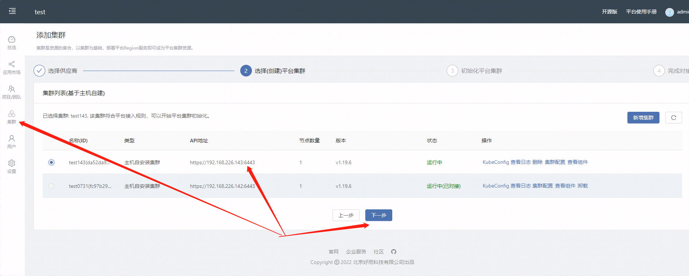

# k8s 部署 fastboot

## 1.安装kubernates环境

我这里用 rainbond 管理的 k8s 环境

### rainbond安装 [官网地址](https://www.rainbond.com/docs/installation/install-with-dind)

#### rainbond依赖docker，先安装docker

```shell
curl sh.rainbond.com/install_docker | bash
```

#### docker安装rainbond单机版

#### 设置环境变量(必须)

```shell 
export EIP=192.168.226.137

```

```shell
docker run --privileged -d -p 7070:7070 -p 80:80 -p 443:443 -p 6060:6060 -p 8443:8443 \
--name=rainbond-allinone --restart=on-failure \
-v ~/.ssh:/root/.ssh \
-v ~/rainbonddata:/app/data \
-v /opt/rainbond:/opt/rainbond \
-v ~/dockerdata:/var/lib/docker \
-e ENABLE_CLUSTER=true \
-e EIP=$EIP \
registry.cn-hangzhou.aliyuncs.com/goodrain/rainbond:v5.7.1-dind-allinone \
&& docker logs -f rainbond-allinone

```

#### 提示这个之后就启动成功了

```
正在加载数据，预计3分钟，时间取决于磁盘性能...
正在启动Rainbond，预计5分钟...
Rainbond启动成功，可以通过访问: http://$EIP:7070 进入Rainbond控制台
```

#### 进入

浏览器打开 192.168.226.137:7070
首次登录需要设置用户名密码

登录后，在集群这里添加主机，

主机添加后配置主机,需在主机执行一段初始化命令，执行用户需要具有sudo权限

执行完成提示如下

```
[INFO] generate docker service file
[INFO] generate docker config file
[INFO] prepare register mirror for CN
[INFO] turn off selinux in CentOS/Redhat
[INFO] enable and start docker
Created symlink from /etc/systemd/system/multi-user.target.wants/docker.service to /etc/systemd/system/docker.service.
[INFO] The node initialization has been completed, please continue to complete the installation operation on the platform 
[INFO] Kernel version must be higher than 4.0, Please upgrade the kernel to 4.0+ as soon as possible 
OpenSSH_7.4p1, OpenSSL 1.0.2k-fips  26 Jan 2017
```

配置完成后，点确认会自动在主机安装k8环境
安装完成提示如下

```a
集群安装过程预计10分钟，请耐心等待，若遇到错误请反馈到社区获取官方支持
控制器初始化
检测提供的参数是否正确

cloud adaptor create success

初始化集群配置
初始化创建集群所需要的配置数据

init cluster config success

安装集群
连接所有节点安装 Kubernetes 集群，耗时取决于网络状况。

da52da9bfacc41dfb22840ec88efa899

已结束
```

#### 初始化k8s

回到集群那里
点击添加集群，可以看到刚刚添加的143服务器

点击下一步

点击开始初始化
成功如下所示

```
平台集群初始化进度查询
初始化流程预计耗时20分钟，请耐心等待，若遇到错误请反馈到社区获取官方支持
控制器初始化
检测提供的参数是否正确

cloud adaptor create success

检测Kubernetes集群
对选择的Kubernetes集群进行适配性检测

da52da9bfacc41dfb22840ec88efa899

启动集群初始化控制器
集群控制器创建并启动

启动集群本地镜像仓库(预计5分钟)
本地镜像仓库就绪意味着存储、网关等服务已就绪，本阶段预计5分钟，取决于网络状况

系统所需的非组件镜像本地化处理(预计5分钟)
将平台需要的非组件镜像获取完成并推送到本地镜像仓库

获取集群访问配置文件(预计5分钟)
等待集群服务启动完成，当API服务可以正常访问则集群访问配置文件已获取完成

初始化平台集群
等待平台集群初始化完成

da52da9bfacc41dfb22840ec88efa899

已结束
```

#### 创建应用


源码地址

```git
https://gitee.com/stylesmile/fastboot-example.git
```


点击fastboot-web-example

可以看到应用后台

点击日志可以查看日志

提示如下，则启动成功

```
App runtime begin start app service grd4f6fc
waiting app ready timeout 40s
current instance(count:0 ready:0 notready:0)
Create all app model success, will waiting app ready
Start service grd4f6fc success
```

启动成功之后可以在这里点击查看java运行日志
服务启动端口为8081，启动时间47毫秒

外部访问容易需要添加端口

还需开通对外访问

还需配置网关

这样就可以直接访问了

